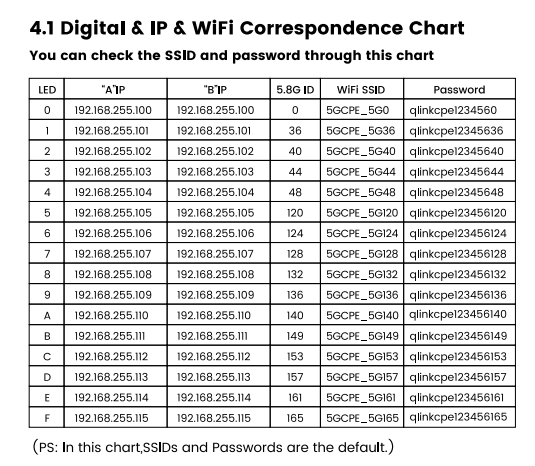

# Hacking the UeeVii CPE990 Firmware

This repo contains the notes from hacking a UeeVii CPE990

- https://ueevii.com/pages/download
- [CPE990 - Manual](https://cdn.shopify.com/s/files/1/0823/2740/4841/files/UeeVii_CPE990_Wireless_Bridge_User_Manual.pdf?v=1743998228)
- [CPE990 - Firmware](https://cdn.shopify.com/s/files/1/0823/2740/4841/files/7621-1000M-21A_3.4.3.4-017.trx?v=1743997929)

## Info

```info
Brand:  UeeVii
Model:  CPE-990
CPU:    MT7621A + MT7612EN
Flash:  8M
DRAM:   DDR3 128M
NIC:    1Gb x 2 (PoE)
Power:  12V, PoE 24V ~1A
```

### Firmware

Filename: [7621-1000M-21A_3.4.3.4-017.trx](firmware/7621-1000M-21A_3.4.3.4-017.trx)

### Password Table



## Issues

- Overpriced - $40+ USD
- GPL Violation - no access to open source info
- Does not support wireless security above WPA2
- Known WPA2 PSK - `qlinkcpe1234560` `qlinkcpe123456???`
- Less than 1Gb (wireless) speed - ~100-400 Mbps
- `Linux CPE5G-A 3.4.113 #1 SMP Mon Nov 27 18:17:04 PST 2023 mips GNU/Linux`
  - Older Linux Kernel
  - Flash 8M
- `ssh` (`dropbear`) is available, but old key usage
